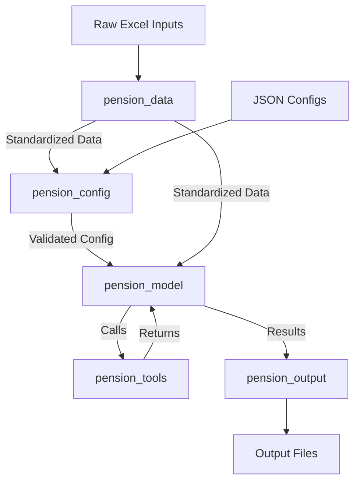

# Florida FRS Pension Model Migration Plan

## Project Overview

**Goal:** Migrate the Florida FRS pension simulation model from R to Python, creating a general-purpose, well-structured pension modeling framework.

**Source:** `R_model/R_model_original/`
**Target:** Python-based modular pension model

---

## Background

### Problem Statement
The existing R model has significant issues:
- **Global variables everywhere** - Makes testing and debugging difficult
- **Hard-coded numbers** - Not configurable, plan-specific values embedded in code
- **Poor memory usage** - Inefficient data structures
- **Slow performance** - Not optimized for speed
- **Plan-specific** - Tied to Florida FRS, not generalizable

### Objectives
1. **Generalizability** - Model should work for any standard pension plan
2. **Clean Architecture** - No global variables, proper separation of concerns
3. **Configuration-Driven** - All assumptions and parameters in JSON files
4. **Testability** - Each component validated against R model outputs
5. **Performance** - Significant speed improvement over R implementation
6. **Maintainability** - Well-documented code following best practices

### Success Criteria
- **Accuracy:** Python model matches R model results within tolerance (<0.1% difference)
- **Performance:** Significant speed improvement over R implementation
- **Maintainability:** Clean, documented code with no global state
- **Flexibility:** Can model different pension plans by changing config files

---

## Architecture

### Module Structure

**IMPORTANT:** This architecture follows Python best practices and is NOT tied to the R project structure. The design is de novo, using modern Python patterns.

```
pension_model/
├── src/
│   ├── pension_data/          # Data ingestion and standardization
│   │   ├── __init__.py
│   │   ├── loaders.py         # Excel/CSV data loading
│   │   ├── transformers.py    # Transform raw data to standard format
│   │   └── schemas.py         # Pydantic models for validation
│   │
│   ├── pension_tools/         # Actuarial functions (pure functions, no state)
│   │   ├── __init__.py
│   │   ├── financial.py       # PV, NPV, FV, discount factors
│   │   ├── salary.py          # Salary growth projections
│   │   ├── mortality.py       # Mortality tables and calculations
│   │   ├── withdrawal.py      # Withdrawal/termination rates
│   │   ├── retirement.py      # Retirement eligibility and factors
│   │   ├── benefit.py         # Benefit calculations
│   │   └── amortization.py    # Amortization calculations
│   │
│   ├── pension_config/        # Configuration management
│   │   ├── __init__.py
│   │   ├── plan.py            # Plan-specific parameters
│   │   ├── assumptions.py     # Actuarial/economic assumptions
│   │   ├── tiers.py           # Tier definitions
│   │   └── scenarios.py       # Scenario management
│   │
│   ├── pension_model/         # Core calculations
│   │   ├── __init__.py
│   │   ├── engine.py          # Main simulation engine
│   │   ├── workforce.py       # Workforce modeling and projection
│   │   ├── benefits.py        # Benefit calculations
│   │   ├── liability.py       # Liability projections
│   │   ├── funding.py         # Funding/amortization calculations
│   │   └── cola.py            # COLA calculations
│   │
│   └── pension_output/        # Output generation and formatting
│       ├── __init__.py
│       ├── tables.py          # Generate output tables
│       ├── summaries.py       # Generate summary statistics
│       └── export.py          # Export to various formats
│
├── configs/               # JSON configuration files
│   ├── plan_config.json   # Plan parameters
│   ├── assumptions.json   # Actuarial assumptions
│   ├── tiers.json         # Tier definitions
│   └── scenarios/         # Scenario-specific configs
│
├── tests/                 # Test suite
│   ├── test_pension_data/
│   ├── test_pension_tools/
│   ├── test_pension_config/
│   ├── test_pension_model/
│   └── test_integration/
│
├── scripts/               # Utility scripts
│   └── extract_baseline.R # R baseline extraction
│
├── baseline_outputs/       # R model outputs for comparison
├── pyproject.toml         # Python project configuration
├── .gitignore
└── README.md
```

### Key Design Principles

1. **No Global Variables** - All state passed explicitly via parameters or class instances
2. **Pure Functions in Tools** - `pension_tools` contains only stateless functions
3. **Configuration-Driven** - Plan parameters loaded from JSON, validated with Pydantic
4. **Testable** - Each module has unit tests comparing against R model outputs
5. **Generalizable** - Designed to handle multiple pension plans, not just Florida FRS
6. **Type Hints** - All functions use Python type hints for better IDE support
7. **Dataclasses/Pydantic** - Structured data models for complex objects
8. **Python Best Practices** - Following PEP 8, using modern Python patterns

---

## Data Flow



---

## Development Milestones

### Phase 0: Foundation (Setup & Infrastructure)
- [x] Initialize git repository
- [x] Set up Python project structure (pyproject.toml, src layout)
- [x] Configure development tools (pytest, black, mypy, ruff)
- [ ] Create directory structure
- [ ] Set up pre-commit hooks

### Phase 1: R Baseline Extraction
- [x] Create R script to run baseline case and capture all intermediate outputs
- [ ] Save R outputs to CSV/JSON for comparison
- [ ] Document all global variables in R code
- [ ] Catalog all R functions and their purposes
- [ ] Create test fixtures from R outputs

### Phase 2: Configuration Module (pension_config)
- [ ] Design JSON schema for plan configuration
- [ ] Create Pydantic models for validation
- [ ] Implement config_loader with validation
- [ ] Create config files for Florida FRS (from R inputs)
- [ ] Add scenario management

### Phase 3: Data Module (pension_data)
- [ ] Extract and document R model input data structures
- [ ] Create Pydantic schemas for all data types
- [ ] Implement excel_loader for all input files
- [ ] Implement data_transformer to standardize formats
- [ ] **Validate: Row counts and basic statistics match R**

### Phase 4: Tools Module (pension_tools)
- [ ] Port financial functions (PV, NPV, FV, discount factors)
- [ ] Port salary growth functions
- [ ] Port mortality table handling
- [ ] Port withdrawal rate calculations
- [ ] Port retirement eligibility logic
- [ ] Port benefit calculation functions
- [ ] Port amortization calculations
- [ ] **Validate: Each function against R outputs**

### Phase 5: Model Module (pension_model)
- [ ] Port workforce projection logic
- [ ] Port liability calculation logic
- [ ] Port funding/amortization logic
- [ ] Port COLA calculations
- [ ] Implement main projection engine
- [ ] **Validate: Aggregate results against R model**

### Phase 6: Output Module (pension_output)
- [ ] Implement table generation (matching R output format)
- [ ] Implement summary statistics
- [ ] Implement export functionality
- [ ] **Validate: Output files match R format and values**

### Phase 7: Integration & Validation
- [ ] End-to-end comparison with R model results
- [ ] Document all discrepancies in issues.md
- [ ] Performance benchmarking
- [ ] Documentation and usage examples

---

## R Model Analysis

### Key Files and Their Purposes

| File | Purpose | Priority |
|------|---------|----------|
| `Florida FRS master.R` | Main orchestration | Reference |
| `Florida FRS model input.R` | Data loading and constants | **1** |
| `utility_functions.R` | Helper functions | **2** |
| `Florida FRS workforce model.R` | Workforce projections | **3** |
| `Florida FRS benefit model.R` | Benefit calculations | **4** |
| `Florida FRS liability model.R` | Liability projections | **5** |
| `Florida FRS funding model.R` | Funding calculations | **6** |

### Membership Classes
The R model handles 7 membership classes:
1. Regular
2. Special Risk
3. Special Risk Administrative
4. Judicial
5. Legislators/Attorney/Cabinet (ECO)
6. Local (ESO)
7. Senior Management

### Key Global Variables (to be catalogued)
- Discount rates (dr_old_, dr_current_, dr_new_)
- COLA assumptions (cola_tier_1_active_, etc.)
- DB/DC ratios for each class
- Funding policy parameters
- Model period and year ranges

---

## Validation Strategy

### Tolerance Thresholds

| Metric Type | Acceptable Difference |
|-------------|----------------------|
| Counts (headcount) | ±1 (exact match expected) |
| Rates | ±0.0001 (0.01%) |
| Currency | ±$1,000 or 0.1% |
| Present Values | ±0.1% |

### Test Levels

1. **Unit Tests** - Each function in `pension_tools` tested against R
2. **Module Tests** - Each module's main functions tested
3. **Integration Tests** - End-to-end runs compared to R baseline
4. **Regression Tests** - Ensure changes don't break existing functionality

---

## Technology Stack

### Core Dependencies
- **Python 3.11+** - Modern Python with type hints
- **pandas** - Data manipulation
- **numpy** - Numerical calculations
- **pydantic** - Data validation and settings
- **openpyxl** - Excel file reading
- **pytest** - Testing framework

### Development Tools
- **black** - Code formatting
- **ruff** - Fast linter
- **mypy** - Type checking
- **pre-commit** - Git hooks

---

## Git Setup Commands

```bash
# Initialize git
git init

# Create .gitignore (if not exists)
cat > .gitignore << 'EOF'
# Python
__pycache__/
*.py[cod]
*$py.class
*.so
.Python
venv/
env/
.venv/

# IDE
.vscode/
.idea/
*.swp
*.swo

# R
.Rproj.user
.Rhistory
.RData
.Ruserdata

# Outputs
*.rds
*.xlsx
*.csv
!configs/*.csv

# Memory bank (optional - commit if desired)
memory-bank/

# Actuarial calculations (optional)
actuarial_calculations/
EOF

# Initial commit
git add .
git commit -m "Initial commit: R model baseline"
```

---

## Next Steps

1. **Complete Python project structure** - Remaining __init__.py files and module files
2. **Run R baseline extraction** - `Rscript scripts/extract_baseline.R`
3. **Implement configuration module** - Start with Pydantic schemas
4. **Implement data module** - Excel loading and transformation
5. **Implement tools module** - Pure actuarial functions
6. **Implement model module** - Core calculation engines
7. **Implement output module** - Table generation and export
8. **Validate against R baseline** - Compare outputs

---

## References

- **R Model Location:** `R_model/R_model_original/`
- **Actuarial Math Guide:** `actuarial_calculations/pension-mathematics-guide/`
- **Winklevoss Text:** `actuarial_calculations/Winklevoss - 1993 - Pension mathematics with numerical illustrations.pdf`
- **Main R Script:** `R_model/R_model_original/Florida FRS master.R`
- **Baseline Call:** `baseline_funding <- get_funding_data()` (line 50, commented out)
