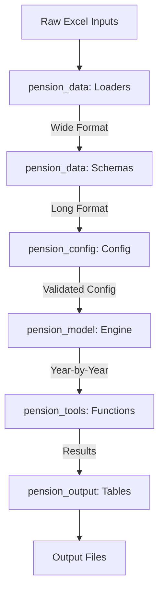

# Florida FRS Pension Model Migration Plan

## Current Status (Updated 2026-03-30)

**IMPORTANT: The phase completion markers below are OUTDATED. See this section for honest status.**

| Component | Real Status | Notes |
|-----------|-------------|-------|
| Workforce Projection | **VALIDATED 100%** | All 7 classes, 31 years, 0.00% diff |
| Active Benefit/Liability | **VALIDATED 100%** | Payroll, PVFB, PVFNC, AAL, NC rate - all 7 classes, 31 years, 0.00% |
| Current Retiree AAL | **VALIDATED ~0.004%** | All 7 classes; tiny gap from ben_payment_ratio precision |
| Current Term Vested AAL | **VALIDATED 100%** | All 7 classes, 0.00% diff |
| Projected Term/Retire/Refund | **VALIDATED 0.00%** | All 7 classes, all 8 sub-components |
| Total AAL | **VALIDATED 0.00%** | All 7 classes, legacy+new, gain/loss=0 |
| End-to-End Pipeline | **VALIDATED 0.00%** | Raw inputs → liability output, all 7 classes |
| Funding Calculation | **30% Framework Only** | Only has AAL roll-forward; missing assets, amortization, contributions |
| Test Suite | **17 tests passing** | Benefit table construction validated per-step against R |

**Next Priority:** Phase C - Funding model (assets, contributions, amortization, funding ratio).

---

## Project Overview

**Goal:** Migrate the Florida FRS pension simulation model from R to Python, creating a general-purpose, well-structured pension modeling framework.

**Source:** `R_model/R_model_original/`
**Target:** Python-based modular pension model

---

## Background

### Problem Statement
The existing R model has significant issues:
- **Global variables everywhere** - Makes testing and debugging difficult
- **Hard-coded numbers** - Not configurable, plan-specific values embedded in code
- **Poor memory usage** - Inefficient data structures, keeps everything in memory
- **Slow performance** - Not optimized for speed
- **Plan-specific** - Tied to Florida FRS, not generalizable

### Objectives
1. **Generalizability** - Model should work for any standard pension plan
2. **Clean Architecture** - No global variables, proper separation of concerns
3. **Configuration-Driven** - All assumptions and parameters in JSON files
4. **Testability** - Each component validated against R model outputs
5. **Performance** - Significant speed improvement over R implementation
6. **Maintainability** - Well-documented code following best practices
7. **Memory Efficiency** - Stream data processing, don't keep everything in memory

### Success Criteria
- **Accuracy:** Python model matches R model results within tolerance (<0.1% difference)
- **Performance:** Significant speed improvement over R implementation
- **Maintainability:** Clean, documented code with no global state
- **Flexibility:** Can model different pension plans by changing config files
- **Memory Efficiency:** Stream data year-by-year, don't keep historical data in memory

---

## Architecture

### Module Structure

**DESIGN PHILOSOPHY:**
- Use **long format** (one row = one entity) for core calculation data
- Use **wide format** only for input/reference tables (salary schedules, mortality tables)
- Store only what's needed for calculations, not historical data
- Stream data year by year, discard intermediate results
- Most memory efficient

```
pension_model/
├── src/
│   ├── pension_data/          # Data ingestion and standardization
│   │   ├── __init__.py
│   │   ├── loaders.py         # Excel/CSV data loading
│   │   ├── schemas.py         # Pydantic models for validation
│   │   └── config.py         # Configuration loading
│   │
│   ├── pension_tools/         # Actuarial functions (pure functions, no state)
│   │   ├── __init__.py
│   │   ├── financial.py       # PV, NPV, FV, discount factors
│   │   ├── salary.py          # Salary growth projections
│   │   ├── mortality.py       # Mortality tables and calculations
│   │   ├── withdrawal.py      # Withdrawal/termination rates
│   │   ├── retirement.py      # Retirement eligibility and factors
│   │   ├── benefit.py         # Benefit calculations
│   │   └── amortization.py    # Amortization calculations
│   │
│   ├── pension_config/        # Configuration management
│   │   ├── __init__.py
│   │   ├── plan.py            # Plan-specific parameters
│   │   ├── assumptions.py     # Actuarial/economic assumptions
│   │   ├── tiers.py           # Tier definitions
│   │   └── scenarios.py       # Scenario management
│   │
│   ├── pension_model/         # Core calculations
│   │   ├── __init__.py
│   │   ├── engine.py          # Main simulation engine
│   │   ├── workforce.py       # Workforce modeling and projection
│   │   ├── benefits.py        # Benefit calculations
│   │   ├── liability.py       # Liability projections
│   │   ├── funding.py         # Funding/amortization calculations
│   │   └── cola.py            # COLA calculations
│   │
│   ├── pension_output/        # Output generation and formatting
│   │   ├── __init__.py
│   │   ├── tables.py          # Generate output tables
│   │   ├── summaries.py       # Generate summary statistics
│   │   └── export.py          # Export to various formats
│   │
│   └── __init__.py         # Package initialization
│
├── configs/               # JSON configuration files
│   ├── plan_config.json   # Plan parameters
│   ├── assumptions.json   # Actuarial assumptions
│   ├── tiers.json         # Tier definitions
│   └── scenarios/         # Scenario-specific configs
│
├── tests/                 # Test suite
│   ├── test_pension_data/
│   ├── test_pension_tools/
│   ├── test_pension_config/
│   ├── test_pension_model/
│   └── test_integration/
│
├── scripts/               # Utility scripts
│   └── extract_baseline.R # R baseline extraction
│
├── baseline_outputs/       # R model outputs for comparison
├── memory-bank/           # Project documentation
├── pyproject.toml         # Python project configuration
├── .gitignore
└── README.md
```

### Key Design Principles

1. **No Global Variables** - All state passed explicitly via parameters or class instances
2. **Pure Functions in Tools** - `pension_tools` contains only stateless functions
3. **Configuration-Driven** - Plan parameters loaded from JSON, validated with Pydantic
4. **Testable** - Each module has unit tests comparing against R model outputs
5. **Generalizable** - Designed to handle multiple pension plans, not just Florida FRS
6. **Type Hints** - All functions use Python type hints for better IDE support
7. **Dataclasses/Pydantic** - Structured data models for complex objects
8. **Memory Efficient** - Stream data year-by-year, discard intermediate results
9. **Long Format for Core Data** - One row per entity for calculations
10. **Wide Format for Reference Data** - Input tables kept in wide format

---

## Data Structure Design

### Core Philosophy

**Problem:** R model keeps EVERYTHING in memory - all years, all classes, all arrays. This is:
- Memory intensive
- Unnecessary for year-by-year calculations
- Not generalizable (hard-coded structure)

**Solution:** Stream data year-by-year, keeping only what's needed

### Data Formats

| Data Type | Format | Rationale |
|------------|--------|-----------|
| Input/Reference Tables | Wide (multi-column) | These are lookup tables, not calculation results. Keep as reference. |
| Salary Schedules | Wide | Used for salary growth calculations. |
| Mortality Tables | Wide | Used for qx lookups. |
| Withdrawal Tables | Wide | Used for rate lookups. |
| Retirement Tables | Wide | Used for eligibility/factor lookups. |
| **Workforce Projections** | **Long** | One row = one entity (member in year). Most memory efficient. |
| **Benefit Valuations** | **Long** | One row = one valuation. Discard after use. |
| **Liability Results** | **Long** | One row = one year's results. Discard after use. |
| **Funding Results** | **Long** | One row = one year's results. Discard after use. |

### Entity IDs

**Long Format Design:**
- `membership_class` - Enum (REGULAR, SPECIAL_RISK, etc.)
- `tier` - Enum (TIER_1, TIER_2, TIER_3)
- `entry_age` - Age when member entered plan
- `current_age` - Current age in projection year
- `yos` - Years of service
- `year` - Projection year

**Example Long Format Record:**
```python
{
    "membership_class": "regular",
    "tier": "tier_1",
    "entry_age": 25,
    "current_age": 30,
    "yos": 5,
    "year": 2025,
    "active": 1000,
    "termination": 50,
    "retirement": 10
}
```

---

## Data Flow



---

## Development Milestones

### Phase 0: Foundation (Setup & Infrastructure)
- [x] Initialize git repository
- [x] Set up Python project structure (pyproject.toml, src layout)
- [x] Configure development tools (pytest, black, mypy, ruff)
- [x] Create directory structure
- [x] Set up pre-commit hooks

### Phase 1: R Baseline Extraction
- [x] Create R script to run baseline case and capture all intermediate outputs
- [ ] Save R outputs to CSV/JSON for comparison
- [ ] Document all global variables in R code
- [ ] Catalog all R functions and their purposes
- [ ] Create test fixtures from R outputs

### Phase 2: Configuration Module (pension_config)
- [x] Design JSON schema for plan configuration
- [x] Create Pydantic models for validation
- [ ] Implement config_loader with validation
- [ ] Create config files for Florida FRS (from R inputs)
- [ ] Add scenario management

### Phase 3: Data Module (pension_data)
- [x] Extract and document R model input data structures
- [x] Create Pydantic schemas for all data types
- [x] Implement excel_loader for all input files
- [x] Implement data_transformer to standardize formats
- [ ] **Validate: Row counts and basic statistics match R**

### Phase 4: Tools Module (pension_tools)
- [ ] Port financial functions (PV, NPV, FV, discount factors)
- [ ] Port salary growth functions
- [ ] Port mortality table handling
- [ ] Port withdrawal rate calculations
- [ ] Port retirement eligibility logic
- [ ] Port benefit calculation functions
- [ ] Port amortization calculations
- [ ] **Validate: Each function against R outputs**

### Phase 5: Model Module (pension_model)
- [ ] Port workforce projection logic
- [ ] Port liability calculation logic
- [ ] Port funding/amortization logic
- [ ] Port COLA calculations
- [ ] Implement main projection engine
- [ ] **Validate: Aggregate results against R model**

### Phase 6: Output Module (pension_output)
- [ ] Implement table generation (matching R output format)
- [ ] Implement summary statistics
- [ ] Implement export functionality
- [ ] **Validate: Output files match R format and values**

### Phase 7: Integration & Validation
- [ ] End-to-end comparison with R model results
- [ ] Document all discrepancies in issues.md
- [ ] Performance benchmarking
- [ ] Documentation and usage examples

---

## R Model Analysis

### Key Files and Their Purposes

| File | Purpose | Priority |
|------|---------|----------|
| `Florida FRS master.R` | Main orchestration | Reference |
| `Florida FRS model input.R` | Data loading and constants | **1** |
| `utility_functions.R` | Helper functions | **2** |
| `Florida FRS workforce model.R` | Workforce projections | **3** |
| `Florida FRS benefit model.R` | Benefit calculations | **4** |
| `Florida FRS liability model.R` | Liability projections | **5** |
| `Florida FRS funding model.R` | Funding calculations | **6** |

### Membership Classes (7 total)
1. Regular
2. Special Risk
3. Special Risk Administrative
4. Judicial
5. Legislators/Attorney/Cabinet (ECO)
6. Local (ESO)
7. Senior Management

### Key Global Variables (to be catalogued)
- Discount rates (dr_old_, dr_current_, dr_new_)
- COLA assumptions (cola_tier_1_active_, cola_tier_2_active_, etc.)
- DB/DC ratios for each class
- Funding policy parameters (funding_policy_, amo_period_new_, etc.)
- Model parameters (model_period_, start_year_, new_year_, etc.)

---

## Validation Strategy

### Tolerance Thresholds

| Metric Type | Acceptable Difference |
|-------------|----------------------|
| Counts (headcount) | ±1 (exact match expected) |
| Rates | ±0.0001 (0.01%) |
| Currency | ±$1,000 or 0.1% |
| Present Values | ±0.1% |

### Test Levels

1. **Unit Tests** - Each function in `pension_tools` tested against R
2. **Module Tests** - Each module's main functions tested
3. **Integration Tests** - End-to-end runs compared to R baseline
4. **Regression Tests** - Ensure changes don't break existing functionality

---

## Technology Stack

### Core Dependencies
- **Python 3.11+** - Modern Python with type hints
- **pandas** - Data manipulation
- **numpy** - Numerical calculations
- **pydantic** - Data validation and settings
- **openpyxl** - Excel file reading
- **pytest** - Testing framework

### Development Tools
- **black** - Code formatting
- **ruff** - Fast linter
- **mypy** - Type checking
- **pre-commit** - Git hooks

---

## Git Setup Commands

```bash
# Initialize git
git init

# Create .gitignore (if not exists)
cat > .gitignore << 'EOF'
# Python
__pycache__/
*.py[cod]
*$py.class
*.so
.Python
venv/
env/
.venv/

# IDE
.vscode/
.idea/
*.swp
*.swo

# R
.Rproj.user
.Rhistory
.RData
.Ruserdata

# Outputs
*.rds
*.xlsx
*.csv
!configs/*.csv

# Memory bank (optional - commit if desired)
memory-bank/

# Actuarial calculations (optional)
actuarial_calculations/
EOF

# Initial commit
git add .
git commit -m "Initial commit: R model baseline"
```

---

## Next Steps

1. **Complete Python project structure** - Remaining module files
2. **Run R baseline extraction** - `Rscript scripts/extract_baseline.R`
3. **Implement configuration module** - Start with Pydantic schemas
4. **Implement data module** - Excel loading and transformation
5. **Implement tools module** - Pure actuarial functions
6. **Implement model module** - Core calculation engines
7. **Implement output module** - Table generation and export
8. **Validate against R baseline** - Compare outputs

---

## References

- **R Model Location:** `R_model/R_model_original/`
- **Actuarial Math Guide:** `actuarial_calculations/pension-mathematics-guide/`
- **Winklevoss Text:** `actuarial_calculations/Winklevoss - 1993 - Pension mathematics with numerical illustrations.pdf`
- **Main R Script:** `R_model/R_model_original/Florida FRS master.R`
- **Baseline Call:** `baseline_funding <- get_funding_data()` (line 50, commented out)

---

## Colleague Feedback: Data Quality & Architecture Issues

**Source:** External review of FRS model architecture

### Critical Data Quality Issues in pendata

1. **Benefit Rules Missing Tier 3 Entries**
   - All 7 classes missing tier_3 benefit rules
   - Need to extract correct multipliers from AV source documents
   - Validate against legacy `ben_mult_lookup`

2. **Incomplete Tier 2 Benefit Rules**
   - Regular class: Needs graded multipliers (0.0160, 0.0163, 0.0165, 0.0168)
   - Admin class: Incorrect 0.03 value, needs graded multipliers
   - Special class: Missing 0.02 multiplier for pre-1975 distribution years

3. **Salary Growth Rate Transcription Error**
   - yos=7, regular class: 4.4% should be 4.5%
   - Affects benefit calculations

4. **Class Name Inconsistency**
   - `amortization_bases` uses "senior management" (space)
   - Should use "senior_management" (underscore) for consistency

5. **Dollar Unit Convention Mismatch**
   - Some tables use thousands, others use actual dollars
   - Need universal convention (actual dollars recommended)
   - Affects `retirees$benefits` and other tables

### Architectural Issues

1. **Dual Data Structures in pendata**
   - Legacy format: 329-row tables, minimal metadata (what current model expects)
   - Better structures: 847+ rows, rich metadata, self-documenting
   - Adapter functions needed to convert better → legacy

2. **FRS-Specific Logic Mixed with General Actuarial Logic**
   - Hardcoded FRS assumptions throughout model functions
   - Class-specific logic not abstracted
   - Tier-specific calculations embedded everywhere

3. **Band-to-Single-Year Conversion**
   - Currently embedded in adapter functions
   - Should be in pendata processing pipeline
   - Affects age/yos band expansion

4. **Test Baseline Dependencies**
   - Current tests depend on legacy data errors
   - Will need baseline updates after data fixes

### Generalization Barriers

1. **Hardcoded Plan Parameters**
   - FRS-specific assumptions in functions
   - Need configuration layer for plan-specific rules

2. **Data Format Assumptions**
   - Age/yos granularity assumptions
   - Band vs single-year data format

### Recommendations for Python Migration

1. **Address Data Quality First**
   - Fix tier_2 and tier_3 benefit rules before migration
   - Standardize dollar units to actual dollars
   - Fix class name consistency

2. **Design for Multi-Plan from Start**
   - Abstract FRS-specific logic to configuration
   - Create plan adapter framework
   - Separate general actuarial calculations from plan-specific rules

3. **Direct Consumption of Better Data Structures**
   - Don't replicate legacy format in Python
   - Design Python model to consume rich, self-documenting structures
   - Handle band-to-single-year conversion in data loading layer

4. **Plan Configuration Schema**
   - Define data requirements per plan
   - Create plan registry
   - Implement plan-aware data loading

### Success Metrics

1. **Data Quality**: All pendata issues resolved, consistent unit conventions
2. **Architecture**: No adapter functions, direct consumption of better structures
3. **Generalization**: Model runs with at least 2 different pension plans
4. **Performance**: No regression in computation time
5. **Reliability**: All tests pass with corrected data baselines

### Target Architecture

```
AV Source Documents → pendata Processing Pipeline → Better Data Structures
                                                                    ↓
                                                    Plan Configuration Layer
                                                                    ↓
                                                    General Pension Model
                                                                    ↓
    ┌─────────────────────────────────────────────────────────────────────────┐
    │                    Plan-Specific Layer                                │
    │  ┌──────────────┐  ┌────────────────────┐  ┌──────────────────┐  │
    │  │ FRS Adapter  │  │ Other Plan Adapter │  │ Future Plans...  │  │
    │  └──────────────┘  └────────────────────┘  └──────────────────┘  │
    └─────────────────────────────────────────────────────────────────────────┘
                                                                    ↓
    ┌─────────────────────────────────────────────────────────────────────────┐
    │                   General Actuarial Layer                             │
    │  ┌──────────────┐  ┌────────────────────┐  ┌──────────────────┐  │
    │  │ Core Calculations │  │ pentools Library  │  │ Validation       │  │
    │  └──────────────┘  └────────────────────┘  └──────────────────┘  │
    └─────────────────────────────────────────────────────────────────────────┘
                                                                    ↓
                                                    Results & Reports
```

### Implementation Notes for Python Migration

- **Phase 1**: Fix pendata data quality issues (tier_2/3 benefit rules, salary growth, naming)
- **Phase 2**: Design Python model to consume better structures directly
- **Phase 3**: Implement plan adapter framework with FRS as first plan
- **Phase 4**: Test with second plan to validate generalization
